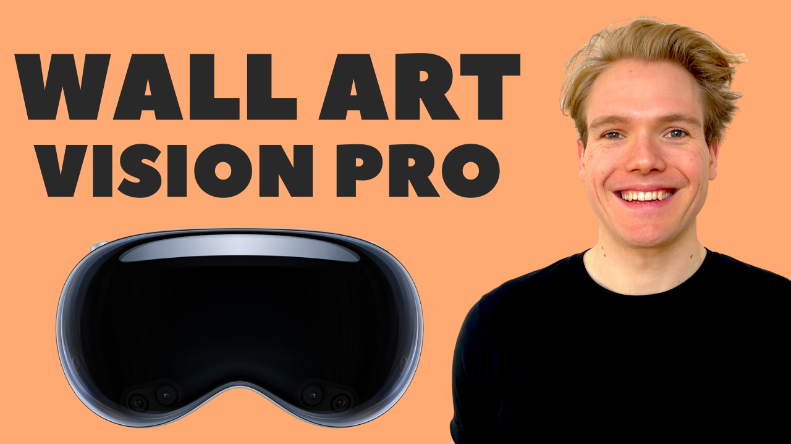

# Generative Wall Art with Apple Vision Pro
A compact example project that demonstrates the core functionalities of visionOS, accompanied by a Youtube tutorial series where we code this example from scratch. 

If you want to get started with development for Apple Vision Pro, this is your perfect starting point. 

Follow us on Twitter:  

### Tutorials

* [Part 0: Building a Vision Pro App with SwiftUI & RealityKit](https://youtu.be/IefFafD8mR8)
* [Part 1: Window Group & Immersive Space](https://youtu.be/KTFh-6LyFEI)
* [Part 2: Reality Kit Entities & Anchors](https://youtu.be/NZ-TJ8Ln7NY)
* [Part 3: SwiftUI Attachments, Combine, Reality Composer Pro Animations](https://youtu.be/m514qEoeOFU)
* _More Videos coming soon!_

### visionOS APIs Used

- Scene Types (WindowGroup & ImmersiveSpace)
- RealityKit
    - AnchorEntity (Plane Detection & Head Tracking)
    - ModelEntity
    - BillboardSystem
    - ParticleEmitterComponent
    - SwiftUI Attachments
    - SimpleMaterial
    - TextureResource
- SwiftUI
    - RealityView
    - Observable Macro
    - Animations
- UIKit
    - UIBezierPath

### 3D Content

This demo handles 3D content in two ways. First, the main character including its animations and particle effects is created in Reality Composer Pro. Second, the image canvas and its resources are created programmatically in Swift.

### Setup

To run this project you need Xcode 15 Beta 5+ and visionOS 1.0 which you can download [here](https://developer.apple.com/download/all/?q=xcode%2015).

1. Clone the repo.
2. Open the project in Xcode 15.
3. Select the root project GenerativeWallArt in the view hierarchy.
4. Go to Signing & Capabilities.
5. Select your development team.
6. Select the Apple Vision Pro simulator as a build target.
7. Build and run the project.
8. Select the museum scene, and move the character to the empty wall.
9. Tap the character to start the demo. 

